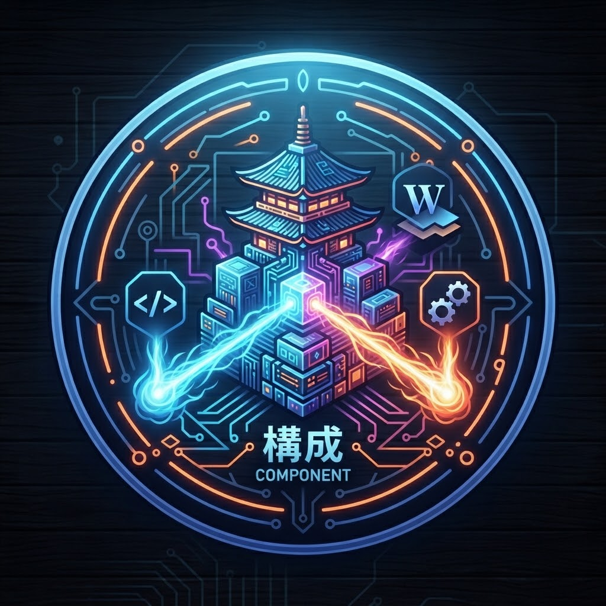

  

# Temario del Curso: Web Components (De Cero a Dios)

Ruta progresiva desde los fundamentos nativos de la plataforma Web hasta patrones avanzados, compilación, rendimiento e integración con inteligencia artificial.

## Módulo 1: Fundamentos Nativos de la Plataforma Web

1.1 Preparación del ambiente de desarrollo y herramientas del ecosistema. (Lección actual)

1.2 ¿Por qué Web Components? El estándar W3C frente a frameworks (React/Angular/Vue).

1.3 Custom Elements v1: Creación de etiquetas personalizadas y ciclo de vida (connectedCallback, disconnectedCallback, attributeChangedCallback, adoptedCallback).

1.4 Shadow DOM v1: Encapsulación estricta, modos (open / closed) y Shadow Root.

1.5 HTML Templates `<template>` y Slotting `<slot>`, composición de UI.

1.6 Estilizado en Shadow DOM: :host, :host-context, ::slotted(), variables CSS y Shadow Parts (::part).

---

## Módulo 2: Estado, Eventos y Arquitectura de Datos

2.1 Manejo de propiedades JS vs. atributos HTML (Reflexión de atributos).

2.2 Custom Events, propagación (bubbles, composed) y desacoplamiento de componentes.

2.3 Formularios nativos con Custom Elements (ElementInternals y formAssociated).

2.4 Patrones de diseño de estado (Unidirectional Data Flow, Pub/Sub nativo).

---

## Módulo 3: Librerías del Ecosistema y Productividad

3.1 Lit (LitElement y lit-html): Renderizado reactivo eficiente.

3.2 Stencil.js: Compilador de Web Components orientado a Design Systems enterprise.

3.3 Fast Element / Shoelace: Creación de librerías de componentes accesibles.

---

## Módulo 4: Patrones Avanzados y Performance

4.1 Declarative Shadow DOM (DSD) y Server-Side Rendering (SSR).

4.2 Web Components con TypeScript estricto y typings para JSX/HTML.

4.3 Microfrontends utilizando Web Components nativos.

4.4 Accessibility (a11y) en Shadow DOM (ARIAMixin y ElementInternals).

---

## Módulo 5: Integración con Inteligencia Artificial (IA)

5.1 Generación dinámica de componentes mediante modelos LLM en el cliente.

5.2 Web Components impulsados por IA Ej. `<ai-chat-bubble>`,`<ai-text-summarizer>`.

---

## Módulo 6: Examen Final y Proyecto "Nivel Dios"

6.1 Construcción y publicación en NPM de un Design System agnóstico completo.
